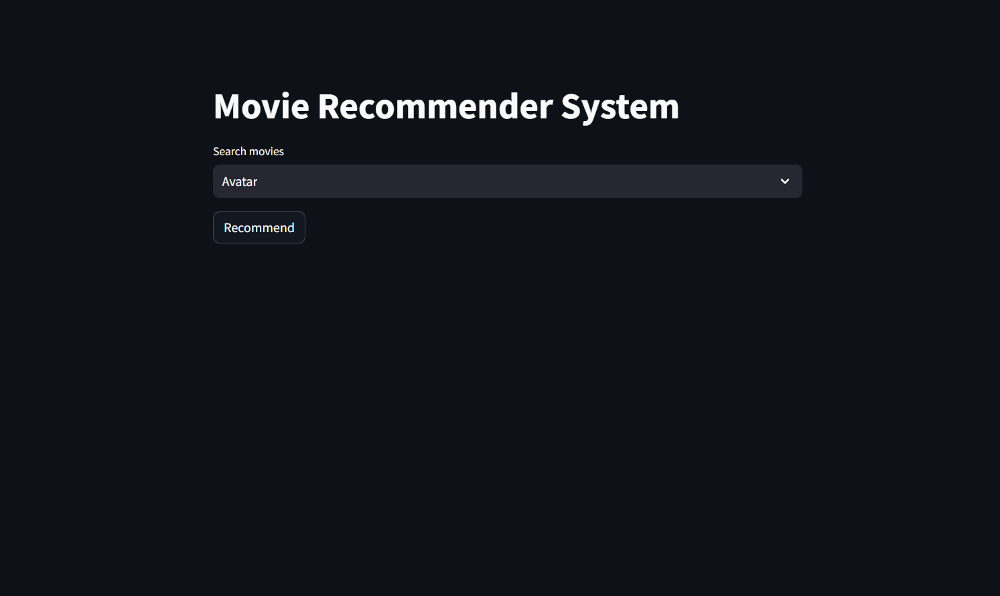
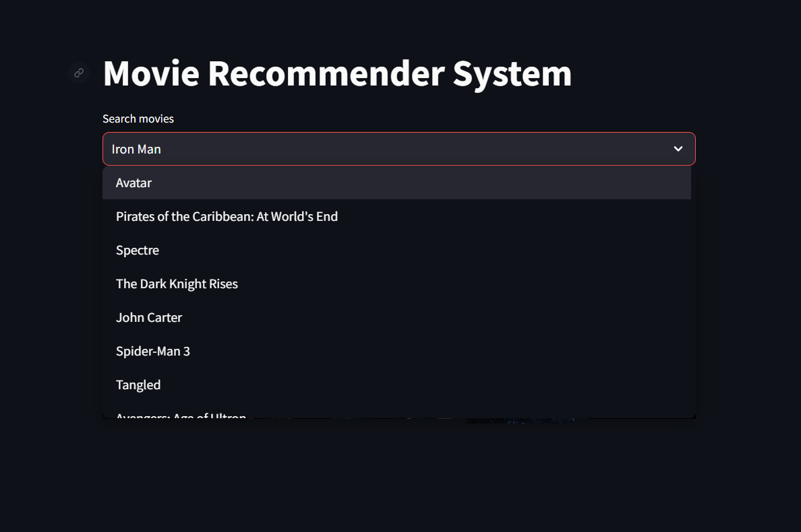
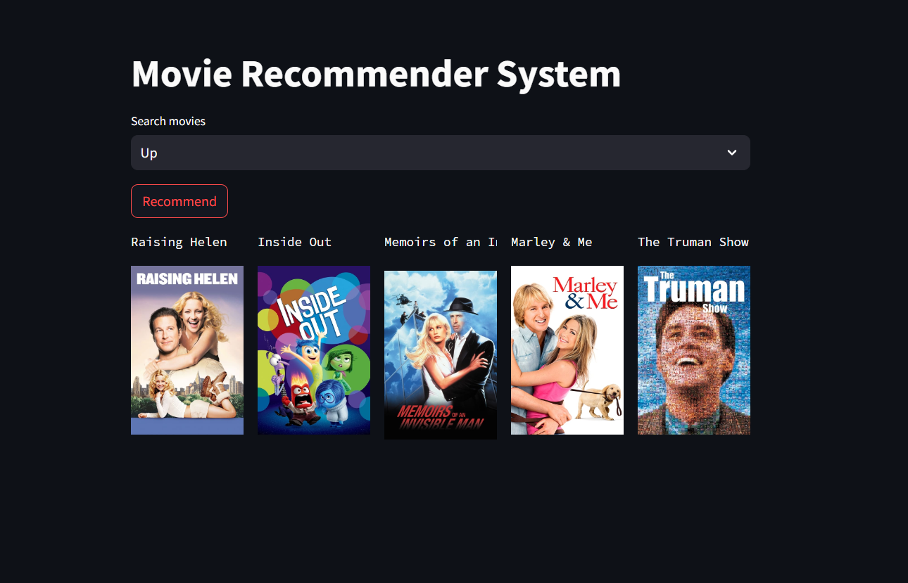
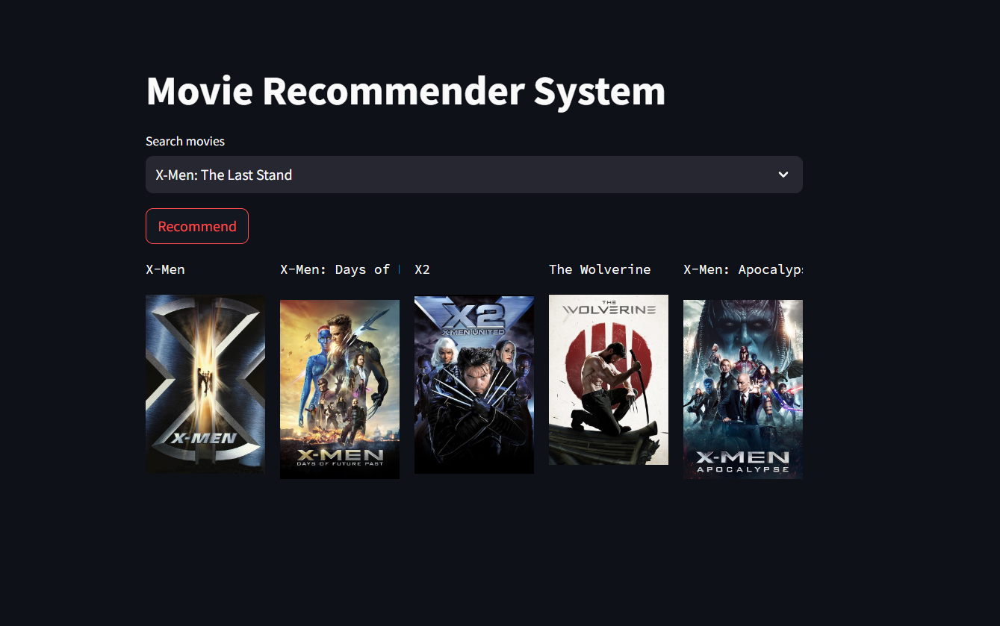
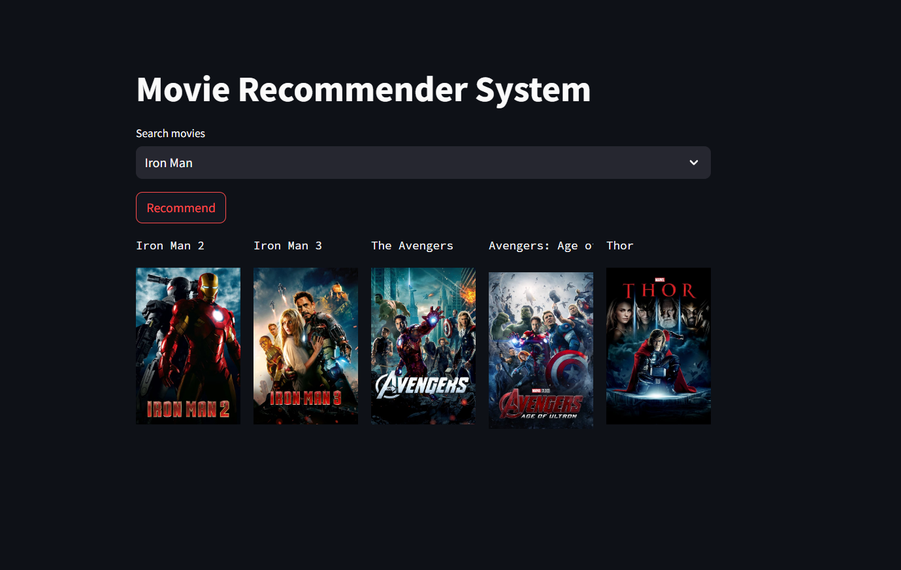

# Movie Recommender System

## Overview

This project is a movie recommender system built using content-based filtering. It leverages the TMDB movie dataset to provide personalized movie recommendations based on movie attributes like genres, descriptions, and other metadata. The recommender system is implemented with Python and presented through a web interface using Streamlit.

## Features

- **Movie Recommendations**: Get recommendations based on a selected movie using content-based filtering.
- **Interactive Web Interface**: Built with Streamlit for a user-friendly experience.
- **Poster Display**: Shows movie posters alongside recommendations.

## Screenshots

### Home Screen


### Recommendation Results








### Movie Poster Display


## Technologies

- **Python**: Programming language used for development.
- **Streamlit**: Framework for creating the web app interface.
- **Pandas**: For data manipulation and handling.
- **Scikit-learn**: For implementing content-based filtering techniques.
- **Requests**: For fetching movie posters from the TMDB API.
- **TMDB API**: Provides movie metadata and poster images.

## Dataset

The project uses the TMDB movie dataset, which includes information about movies such as titles, genres, descriptions, and more.

## Required Files

- `movies.pkl`: Pickle file containing the movie data.
- `similarity.pkl`: Pickle file containing the similarity matrix.

### Download `similarity.pkl`

The `similarity.pkl` file is required for the recommendation algorithm. You can download it from Google Drive using the following link:

[Download similarity.pkl](https://drive.google.com/uc?export=download&id=18eG28eLgNBhT7TzwDU9B6BAC58X6NFHm)

## Setup and Installation

1. **Clone the Repository**:
   ```bash
   git clone https://github.com/Nishnat14/Movies-recommender-system.git
   cd Movies-recommender-system
2. **Create a Virtual Environment (optional but recommended)**:

```bash
python -m venv venv
source venv/bin/activate  # On Windows use `venv\Scripts\activate`
```
3. **Install Required Packages**:

```bash
pip install -r requirements.txt
Obtain TMDB API Key:
```

4. **Sign up at TMDB and get an API key**.

Replace your_api_key in the code with your actual API key.

5. **Download and Place Files**:

Download movies.pkl and similarity.pkl from the provided links.
Place them in the project directory.

## Usage
6. **Run the Streamlit App**:

```bash
streamlit run app.py
```
7. **Access the Web App**:

Open a web browser and navigate to http://localhost:8501.

Select a movie from the dropdown and click the "Recommend" button to get movie recommendations.

## Files.

app.py: Main Streamlit application file.

movies.pkl: Pickle file containing the movie data.

similarity.pkl: Pickle file containing the similarity matrix.

requirements.txt: File listing the required Python packages.
